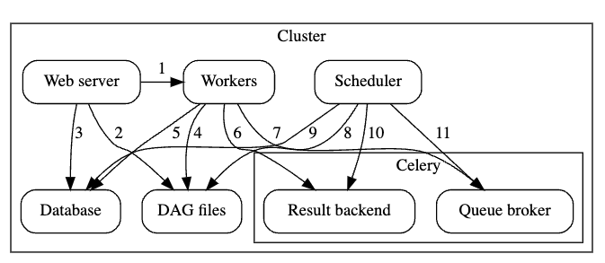

# Chapter 12. 

### Airflow 아키텍처 

- Web Server : web UI 제공
- Scheduler
  - DAG 파일 구분 분석
  - 실행할 task 를 결정하고 task 를 대기열에 배치
- Database 
    - web server 와 scheduler 는 airflow process 인 반면, database 는 airflow에 따로 제공하는 서비스. 
  
- airflow 는 Executor 의 종류에 따라서 구성이 달라지고 설치 방식도 달라진다. 

### Executor 종류

#### 1. SequentialExecutor
- 시연 / 테스트 환경에 적합 
- 가장 단순하게 구성 가능 
- Task 를 하나씩 순차적으로 실행시킴 
- 작업 처리 속도가 상대적으로 느리고 단일 호스트 환경에서만 작동함. 
- SQLite database에 연결됨. 

#### 2. LocalExecutor
- SequentialExecutor와 동일하게, 단일 호스트 환경에서 작동함. 
- 차이점은, LocalExecutor는 여러 Task 를 병렬로 실행할 수 있다. 
  - 따라서 SequentialExecutor에 비해 빠르게 수행할 수 있음. 
  - 하위 프로세스는 하나의 태스크를 실행할 수 있고, 하위 프로세스는 병렬로 실행할 수 있음. 
- Executor 내부적으로 worker process가 FIFO 방식을 통해 대기열에 실행할 Task 등록함.
- 최대 32개 병렬 프로세스 실행 가능. 

Q. SequentialExecutor는 SQLite에 연결되지만 LocalExecutor 사용시에 MySQL, PostgreSQL 을 사용하도록 권장하는 이유는 ? 

#### 3. CeleryExecutor
  

- Celery 란 : 
  - Python Application 에서 Task들을 나눠서 처리하도록 해주는 분산 시스템. 실시간 처리 및 작업 스케줄링을 제공하는 Queue 매커니즘. 
  - Web UI 로 Celery Flower 를 사용하여 worker들을 모니터링 할 수 있다. 

  
  Celery queue 는 2가지 컴포넌트로 구성되어 있다.    

    * Broker : 실행할 명령들을 저장함. 
    * Result Backend : 완료된 결과 상태를 저장함. 

- Celery Executor 작동 방식 
  - Celery 를 이용하여 실행할 Task 들을 대기열에 등록시킴. 
  - Worker가 대기열에 등록된 Task 를 읽어와서 개별적으로 처리함. 
  - Celery 에서는 이 대기열을 Broker 라고 한다. Broker는 Redis, RabbitMQ, AWS SQS

  
#### 4. KubernetesExecutor
- k8s 에서 워크로드를 실행함. 

### Metastore 구성하기 
- Metastore : Airflow 에서 일어나는 모든 일을 Metastore Database에 기록함. 
- Airflow 는 SQLAlchemy 기반으로 Database Task 를 수행함. 따라서 sqlalchemy 에서 지원하는 Database만 사용가능하다. 
  - ex. MySQL, PostgreSQL 
- 별도의 Database 구성이 필요함. 
  - airflow db init : empty database에 airflow schema 생성 
  - airflow db reset : 기존 db 지우고 새 db 생성.  
  - airflow db upgrade : 변경사항만 적용함. 멱등성 보장. 

### 스케줄러 
- DAG 파일을 구문 분석하고 추출된 정보를 DB에 저장한다.
- 실행 준비가 된 Task를 결정하고 Task를 대기 상태로 전환한다. 
- 대기 상태에서 Task 를 가져와서 실행한다. 

#### DAG Processor 
- Airflow Scheduler 는 주기적으로 DAG directory 에 있는 파일을 처리한다. 
주기적으로 파일을 확인하고 새로운 DAG를 발견하면 Airflow metastore에 등록한다. 
- 따라서 DAG가 동적으로 변경되지 않는 경우 재처리 시간 간격을 늘려서 CPU 사용량을 줄이는 것이 효과적
- DAG 처리는 while True 루프 내에서 발생한다. 

#### Task Scheduler 
- 스케줄러는 실행할 Task 인스턴스를 결정하는 역할을 한다. 

#### Task Executor 
- Task Executor 프로세스는 Task Scheduler 프로세스가 Task Instance 를 대기열로 보낼때까지 대기. 
- 대기열에 배치되면 가져와서 Task Instance 를 실행함. 
- Metastore에 각 상태의 변경 사항을 등록함. 
- Executor 내에서 Task 를 실행하면 -> Task 가 실패하더라도 airflow가 중단되지 않도록 Task 를 실행할 새 프로세스를 생성한다. 